# ABI-Pipeline

ABI-Pipeline (Audiobooks Illuminated Pipeline) is a local, semi-automated book illustrator designed for audiobooks and text/EPUB files. It acts as an orchestrator that takes a book as an input and outputs thousands of highly organized, sequentially rendered images aligned with the narrative's progression.

## Table of Contents
- [Core Purpose](#core-purpose)
  - [Optional Player Integration](#optional-player-integration)
- [Prerequisites & Requirements](#prerequisites--requirements)
  - [Software & Host Requirements](#software--host-requirements)
  - [Hardware Considerations](#hardware-considerations)
- [Installation & Setup](#installation--setup)
- [Environmental Footprint & Clean Uninstallation](#environmental-footprint--clean-uninstallation)
  - [Alternative Environments (Conda / Custom Virtual Environments)](#alternative-environments-conda--custom-virtual-environments)
- [Initial Configuration](#initial-configuration)
- [Project Creation](#project-creation)
- [Audiobook Transcription](#audiobook-transcription)
  - [Monitoring Progress](#monitoring-progress)
- [Transcript Approval and Formatting](#transcript-approval-and-formatting)
  - [Audiobook Transcripts](#audiobook-transcripts)
  - [EPUB & Text Imports](#epub--text-imports)
- [Prompt Generation Configuration](#prompt-generation-configuration)
  - [The Decoupled Prompt Philosophy (Content vs. Style)](#the-decoupled-prompt-philosophy-content-vs-style)
  - [The Prompt Playground & Template Tuning](#the-prompt-playground--template-tuning)
  - [Running Batch Generation](#running-batch-generation)
- [Preparing for Image Generation](#preparing-for-image-generation)
- [ComfyUI Workflow Integration](#comfyui-workflow-integration)
- [The LoRA Contact Sheet Tool](#the-lora-contact-sheet-tool)
- [The Style Playground](#the-style-playground)
  - [1. Playground Controls](#1-playground-controls)
  - [2. Style & Workflow Definition](#2-style--workflow-definition)
  - [3. Engine & Workflow Settings (Overrides)](#3-engine--workflow-settings-overrides)
  - [4. AI Toolkit](#4-ai-toolkit)
  - [5. Image Preview Cards](#5-image-preview-cards)
- [Batch Image Generation](#batch-image-generation)
- [Proofreading, Approvals, and Selective Regeneration](#proofreading-approvals-and-selective-regeneration)
  - [The Workspace Grid](#the-workspace-grid)
  - [Selective Regeneration](#selective-regeneration)
- [Packaging Assets (The OIS Packager)](#packaging-assets-the-ois-packager)
  - [Step 1: Global Pack Configuration](#step-1-global-pack-configuration)
  - [Step 2: Pre-Flight Integrity Check](#step-2-pre-flight-integrity-check)
  - [Step 3: Volume Customization & Experience Variants](#step-3-volume-customization--experience-variants)
  - [Step 4: Compiling and Outputting](#step-4-compiling-and-outputting)
- [Playing Your Illuminated Audiobooks](#playing-your-illuminated-audiobooks)
  - [Setup Tips](#setup-tips)

---

## Core Purpose

The primary purpose of ABI-Pipeline is to automate the complex process of illustrating a book at scale. By coordinating local transcription, language models, and image generation interfaces, it systematically processes a text or audio source file to produce a comprehensive visual narrative.

The pipeline manages three main output assets:
* **Sequential Images:** Thousands of rendered PNG files, organized by chapter and scene, representing every distinct visual moment in the book.
* **Baked-in Metadata:** Individual target quotes and subtitle text embedded directly into the metadata chunk of each corresponding PNG image.
* **Timing and Text Alignment:** A structured map pairing every image and quote with its corresponding chapter, scene, or precise time stamp.

Because these assets are exported to clean, standard directories on your local drive, you have complete ownership of the output. You can use the generated files to construct illustrated EPUBs, build video slideshows, or integrate visual narratives into any custom media player.

### Optional Player Integration
For users who wish to experience their illustrated books with synchronized audio, text, and graphics, ABI-Pipeline includes an optional packaging tool (the OIS Packager). This tool bundles the images and timing maps into a single file format optimized for the free **Audiobooks Illuminated** player ecosystem:
* **Desktop Player (Windows):** Available at [audiobooksilluminated.com](https://audiobooksilluminated.com).
* **Mobile Player (Android):** Available on the Google Play Store.

<br>
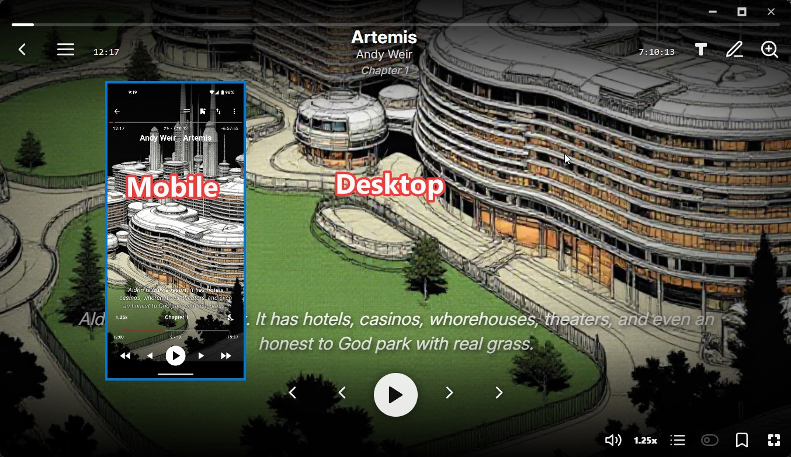
<br>

---

## Prerequisites & Requirements

ABI-Pipeline acts as an orchestrator. It does not need to run on the same physical machine as the heavy AI model hosts, allowing you to distribute workload across your local network if necessary.

### Software & Host Requirements
* **Operating System:** Windows (native `.bat` files provided) or Linux (shell scripts provided).
* **Python Version:** Python 3.10.
* **LLM Host (Local or Remote):** A running instance of Ollama, LM Studio, or any OpenAI-compatible API provider to handle text analysis and prompt generation.
* **Image Generator (Local or Remote):** A running ComfyUI instance accessible via its API port (default: 8188).

### Hardware Considerations
* **Fully Local Run:** If running the pipeline interface, the transcription model, the LLM host, and ComfyUI all on a single machine, a high-VRAM NVIDIA GPU is recommended. The fully local, single-machine workflow has been primarily developed and tested on an NVIDIA RTX 3090 (24GB VRAM).
* **Distributed Run:** If ComfyUI or your LLM host runs on a separate machine on your network, the local system running the pipeline interface requires minimal resources.

---

## Installation & Setup

1. **Clone the Repository:**
   ```bash
   git clone https://github.com/neshani/ABI-Pipeline
   cd ABI-Pipeline
   ```

2. **Run the Environment Installer:**
   * **Windows:** Double-click `setup.bat` or run it from your terminal:
     ```cmd
     setup.bat
     ```
   * **Linux/macOS:** Run the shell setup script:
     ```bash
     chmod +x setup.sh
     ./setup.sh
     ```

3. **Launch the Application:**
   * **Windows:** Run `start.bat` to launch the NiceGUI interface.
   * **Linux/macOS:** Run `start.sh`.

Once launched, open your web browser and navigate to `http://127.0.0.1:8910` to access the pipeline interface.

---

## Environmental Footprint & Clean Uninstallation

By design, ABI-Pipeline keeps your system pristine and localized:

* **Automatic Isolation:** The setup scripts automatically create a Python virtual environment (`.venv`) entirely inside the `ABI-Pipeline` project directory and install all requirements there. No packages are installed globally on your machine.
* **Easy Uninstallation:** Because all files, cache databases, configurations, and environment dependencies reside exclusively inside the project directory, uninstalling the pipeline is as simple as deleting the `ABI-Pipeline` folder. There are no registry keys, global configs, or orphan system files left behind.

### Alternative Environments (Conda / Custom Virtual Environments)
If you prefer to manage Python dependencies yourself using Conda or another custom virtual environment manager, you can easily bypass the helper scripts:
1. Activate your custom environment manually.
2. Install the dependencies using pip: `pip install -r requirements.txt`.
3. Launch the application directly from your terminal:
   ```bash
   python main.py
   ```
*Note: Do not use the provided `start.bat` or `start.sh` scripts if you are running a custom environment, as those scripts are specifically hardcoded to look for the default internal `.venv` directory.*

---

## Initial Configuration

On first launch, the pipeline will display a setup wizard. This interface walks you through configuring the external AI engines and importing starter workflows.

<br>
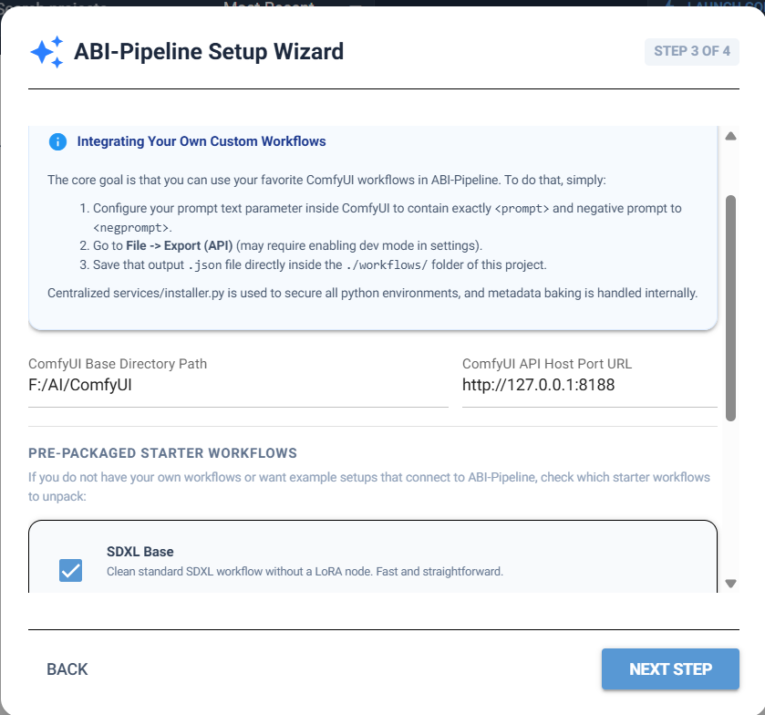
<br>

The wizard guides you through the following configurations:
1. **Transcription Engine (Optional):** Select your preferred transcription engine. Note that if you choose to install the local transcription backend, you must restart the application once setup completes before transcription tasks can run.
2. **LLM Configuration:** Specify the host port URL for your local or remote LLM (such as Ollama or LM Studio).
3. **ComfyUI Integration:** Set the path to your ComfyUI base directory along with the ComfyUI API host URL.
4. **Starter Workflows:** Choose from pre-packaged workflows (like SDXL Base) to unpack into your local `./workflows/` folder.

---

## Project Creation

To illustrate a book, start by creating a project. Click the **Add Project** button to open the import configuration menu.

<br>
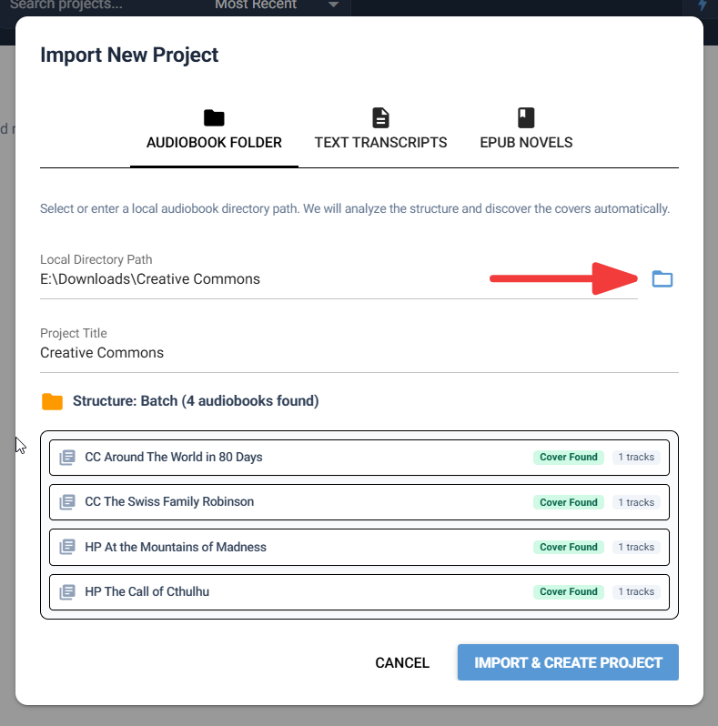
<br>

The pipeline supports three distinct import structures:
* **Audiobook Folder:** Select a directory where each audiobook is contained within its own subfolder. The pipeline automatically scans the directory, maps out the subfolders as separate volumes, and attempts to find local cover art.
* **EPUB Novels:** Point the importer to a folder containing EPUB files. Multiple books can reside in the same import folder.
* **Text Transcripts:** Import plain text files. The importer divides the narrative into chapters based on the `==CHAPTER==` separator tag.

---

## Audiobook Transcription

For audiobook projects, the first phase of the pipeline is translating audio files into plain text transcripts.

<br>
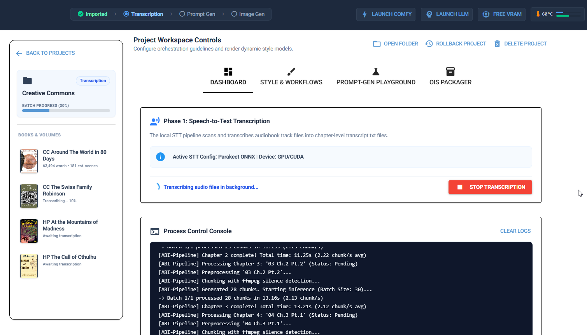
<br>

1. Select your project from the main portal to enter the workspace.
2. Verify that your STT config is active (e.g., Parakeet ONNX on GPU/CUDA).
3. Click **Start Transcription** to begin background processing. 

### Monitoring Progress
Because processing high-volume text and audio takes time, the pipeline runs tasks in the background. The current step progress is displayed in real-time directly inside your browser's tab title, allowing you to monitor active runs while working in other tabs.

<br>

<br>

---

## Transcript Approval and Formatting

Before you can generate prompts, you must approve the imported or transcribed text for each book. This serves as a quality-control step to ensure your narrative content is clean and structured.

<br>
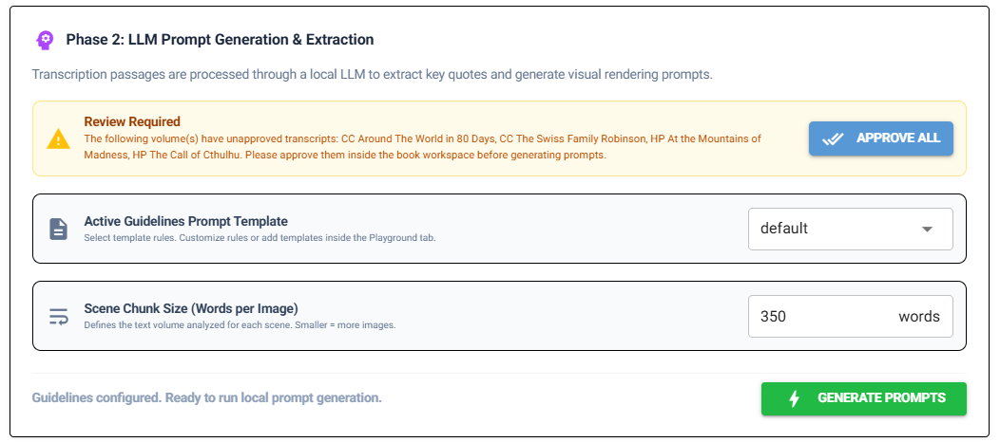
<br>

### Audiobook Transcripts
Transcriptions generated directly from audio files generally align well and do not require heavy editing. For these projects, you can safely use the **Approve All** button to unlock prompt generation for all volumes in the batch.

### EPUB & Text Imports
When importing text directly from publisher files, the raw text often contains front matter, licensing information, tables of contents, or index lists that will waste rendering resources. 

<br>
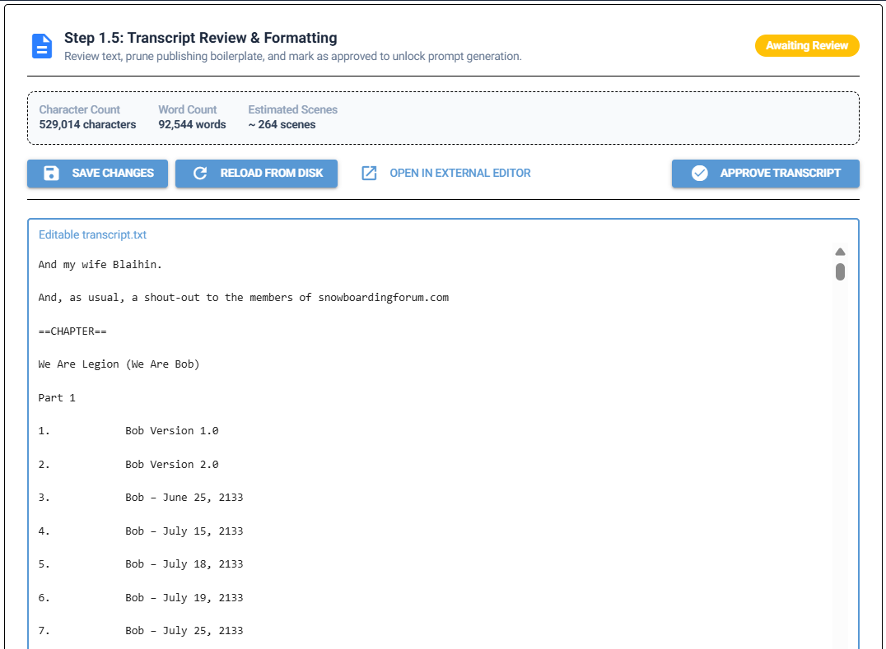
<br>

Use the built-in text editor to review and edit each transcript:
1. Open the target volume in the workspace.
2. Delete publisher boilerplate, preambles, and table of contents.
3. Verify that your chapter divisions are clean.
4. Click **Save Changes** and then **Approve Transcript** to unlock the prompt generation phase.

---

## Prompt Generation Configuration

Prompt generation analyzes the narrative chunks of your approved transcripts and instructs your LLM to extract key quotes and compile detailed visual prompts.

### The Decoupled Prompt Philosophy (Content vs. Style)
A core architectural feature of ABI-Pipeline is the absolute separation of **scene content** from **artistic style**:

* **The LLM's Job (Content Only):** The LLM template is strictly instructed to generate descriptive scene details (e.g., characters, poses, actions, physical settings, and objects). It must avoid generating any stylistic, lighting, or medium-related keywords (such as "digital art," "photorealistic," "oil painting," or "volumetric lighting").
* **The Pipeline's Job (Global Styling):** The artistic medium and visual aesthetic are managed globally in the subsequent rendering phase using a global **Style** which includes things like **Prompt Prefix** and **Prompt Suffix**.

This decoupled design is highly efficient. Because the prompts stored in your `prompts.csv` files contain only raw scene data, you can completely change the art style of a multi-book project (e.g., switching from watercolor sketch to high-detail oil painting) instantly without wasting hours regenerating prompts from your LLM.

### The Prompt Playground & Template Tuning
Different genres and books may require distinct instruction setups to extract clear, style-free scene descriptions. Before running a batch prompt generation, navigate to the **Prompt-Gen Playground** tab to test and tune your parameters.

<br>
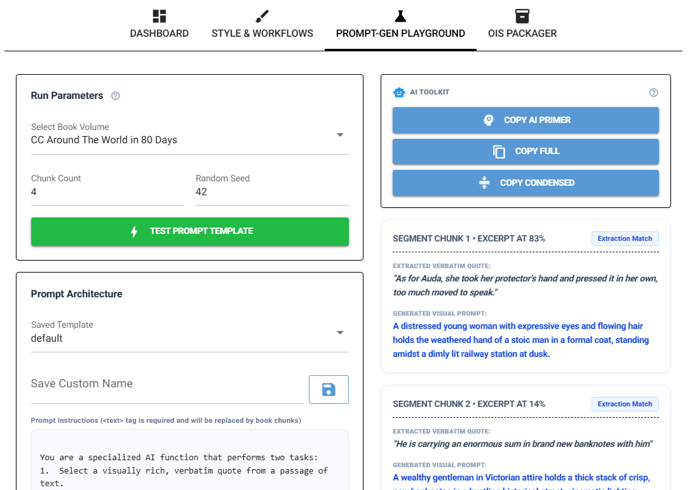
<br>

* **Local LLM Performance:** For optimal local generation speeds, fast models like Gemma 4 (4B or 12B) are recommended. If your local LLM is taking more than a second or two per prompt, ensure that "thinking" or "reasoning" modes are turned off in your LLM host settings.
* **Enterprise LLM Assistance:** If you need assistance tuning your system prompt template to ensure it strictly isolates content from style, the playground provides quick tools to coordinate with enterprise APIs like Claude or ChatGPT.
  * **Copy Primer:** Copies detailed prompt construction instructions, your raw text chunks, and the target output schema to send to an external model.
  * **Copy Full:** Copies your current transcript chunks, extracted quotes, and active prompt structure.
  * **Copy Condensed:** Copies only the output quotes and LLM prompts for rapid iteration.
* **Saving Templates:** Once your prompt instructions reliably extract vivid, style-free scene descriptions, give your custom template a name and save it.

### Running Batch Generation
With your template finalized, return to the main Dashboard to run the process on your project.

1. Select your newly saved template.
2. Set the **Scene Chunk Size (Words per Image)**. This defines how much text is analyzed for each visual scene. A lower word count results in a higher density of generated images across the book (e.g., 350 words per scene is standard).
3. Click **Generate Prompts** to start the local generation run.

As the LLM processes your volumes, scrolling down the Dashboard will display a live feed of successfully generated quotes and visual prompts.

<br>
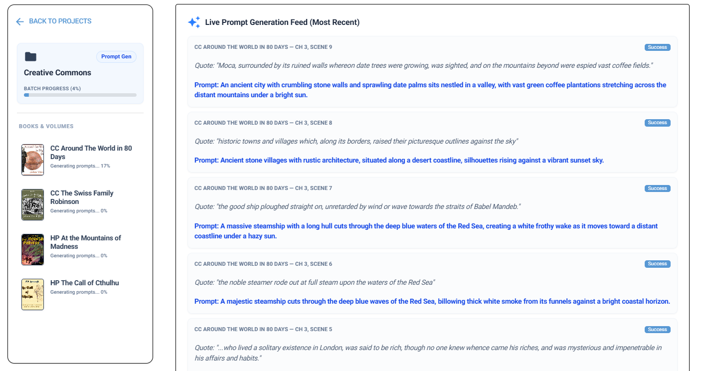
<br>

All active progress, quotes, and prompt parameters are persistently populated in real-time directly inside each book's local master record at `./output/<project name>/<book name>/prompts.csv`.

---

## Preparing for Image Generation

Generating high-volume image sets is resource-intensive. Before transitioning from text processing to rendering, it is recommended to clear your system's VRAM.

<br>
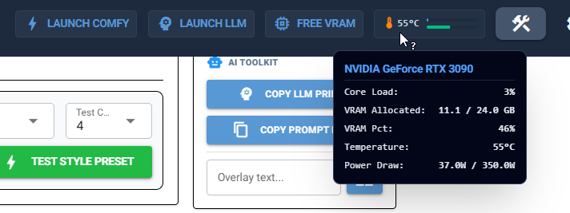
<br>

* **Free VRAM:** Click the **Free VRAM** button in the header. This dispatches an asynchronous command to unload model weights and clear cache from both your LLM host (such as Ollama or LM Studio) and ComfyUI, reclaiming vital system memory for image generation.
* **Telemetry Monitoring:** Keep an eye on your GPU temperature, power draw, and VRAM utilization via the real-time telemetry widget in the topbar.

---

## ComfyUI Workflow Integration

While ABI-Pipeline comes with pre-packaged starter workflows, you will eventually want to use your own custom workflows.

<br>
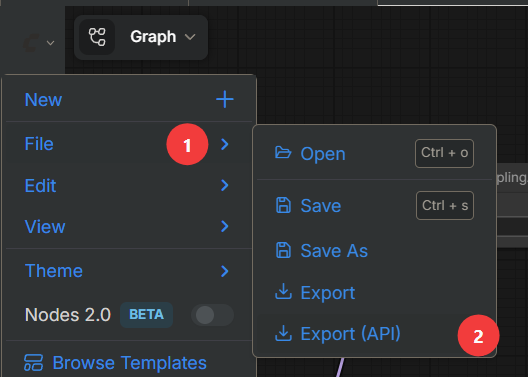
<br>

To integrate a custom ComfyUI workflow:
1. Open your workflow in ComfyUI.
2. Locate your text conditioning nodes. Replace your literal positive prompt text with the exact placeholder `<prompt>`, and your negative prompt text with `<negprompt>`.
3. Open ComfyUI settings, ensure **Developer Mode** is enabled, and navigate to **File -> Export (API)**.
4. Save the generated `.json` file directly inside your local `./workflows/` folder. The pipeline will automatically scan and detect this file.

---

## The LoRA Contact Sheet Tool

Before committing to a specific style, you can test and catalog various LoRA models to understand their trigger words and aesthetic behavior. This tool is accessible under the topbar's tools menu.

1. Define the target LoRAs you wish to test using the following format:
   ```text
   <relative path>|<trigger words or "." for none>|<strength>
   ```
   *Example input configuration:*
   ```text
   SDXL\Hyperdetailed_Illustration.safetensors|ArsMJStyle, HyperDetailed Illustration|0.9
   SDXL\Lucid_Verdant_Dream.safetensors|Lucid Verdant Dream|0.5
   SDXL\MoviePoster03-02_CE_SDXL_128OT.safetensors|mvpstrCE style, movie poster|1.0
   SDXL\Neo-Nihonga_Pop_Surrealism.safetensors|Neo-Nihonga Pop Surrealism|0.7
   ```
2. Click **Generate Contact Sheet**. The tool will automatically render a grid of 20 benchmark images across a diverse set of prompts, embedding coordinate labels on the final composite sheet.

<br>
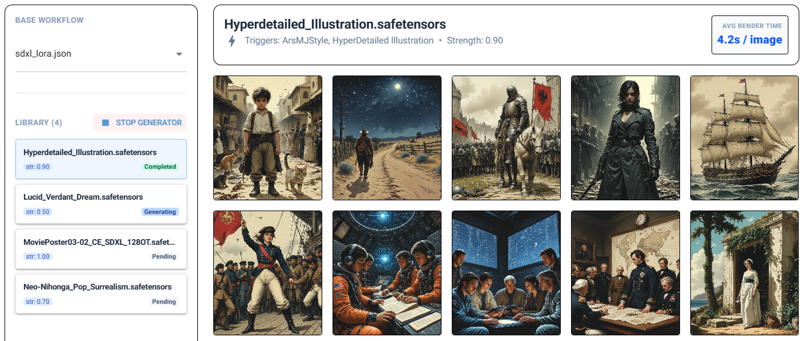
<br>

*Note: Once generated, these tested LoRAs, trigger words, and target strengths are automatically cached and made available in the style overrides panel.*

---

## The Style Playground

The Style Playground is a comprehensive layout where you configure, test, and save style presets before running batch rendering operations.

The interface is divided into five functional areas:

### 1. Playground Controls

<br>
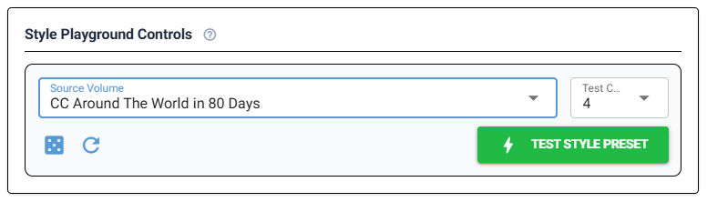
<br>

Use this card to run targeted aesthetic test renders. You can select your target volume, randomly pull scene prompts using the dice button, randomize or fix seeds, set the test image count, and run immediate tests.

### 2. Style & Workflow Definition
This card houses the **Style Preset Chooser** and **Style Preset Saver**.

<br>
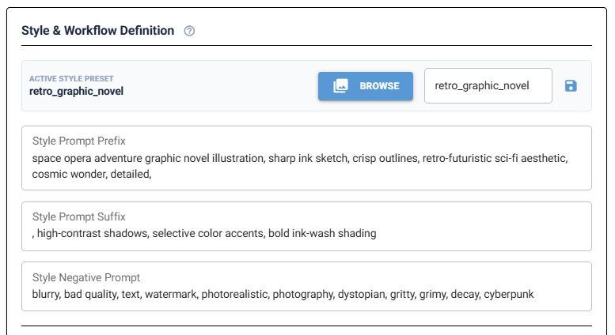
<br>

Use this area to define:
* **Style Prompt Prefix:** Global styling instructions prepended to every prompt (e.g., medium, core aesthetic parameters).
* **Style Prompt Suffix:** Global styling instructions appended to every prompt (e.g., lighting, rendering style).
* **Style Negative Prompt:** Global negative modifiers.

### 3. Engine & Workflow Settings (Overrides)
This panel lets you bind a saved style to a specific ComfyUI workflow and override native node parameters without modifying the underlying workflow file.

<br>
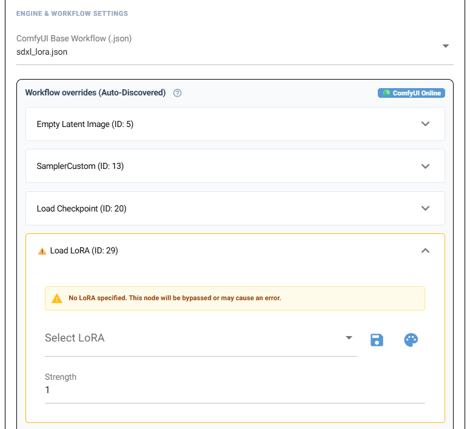
<br>

* **Runtime Overrides:** The pipeline dynamically discovers key nodes in your API JSON (such as Latent Image size, Sampler parameters, Checkpoints, and LoRAs). Overrides set here are saved with the style preset.
* **Saving Workflow Defaults:** Clicking the disk icon next to an override updates the raw `.json` workflow file. *Warning: Saving a change to the raw workflow changes it for all styles utilizing that workflow.*
* **Automatic Trigger Words:** When choosing a LoRA, you can click the palette icon to automatically inject its configured trigger words directly into your prompt prefix. Or you can use the dropdown. Type in the field to filter the dropdown menu.

<br>
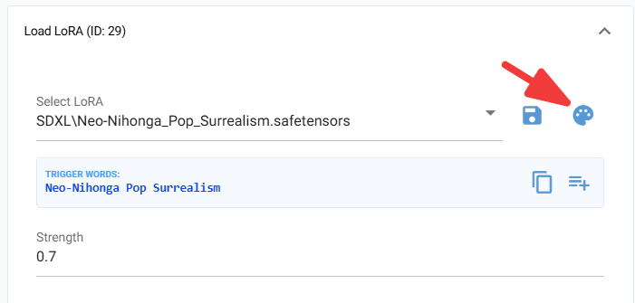
<br>

### 4. AI Toolkit
The AI Toolkit provides tools to evaluate your generated style combinations with external LLMs.

<br>
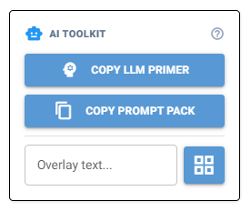
<br>

* **Copy LLM Primer:** Copies detailed instructions explaining your current project objectives to an external chat interface.
* **Copy Prompt Pack:** Copies the current style rules, active prompts, and associated quotes to analyze.
* **Generate Contact Sheet:** Clicking the icon on the right automatically compiles your latest playground test renders into a single composite image, allowing you to right-click, copy, and paste the grid directly into ChatGPT or Claude for aesthetic analysis.

<br>
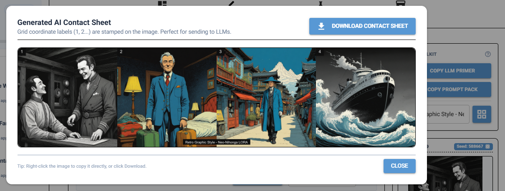
<br>

Change the styles and get feedback from an AI to see which style is the best for the books.

<br>
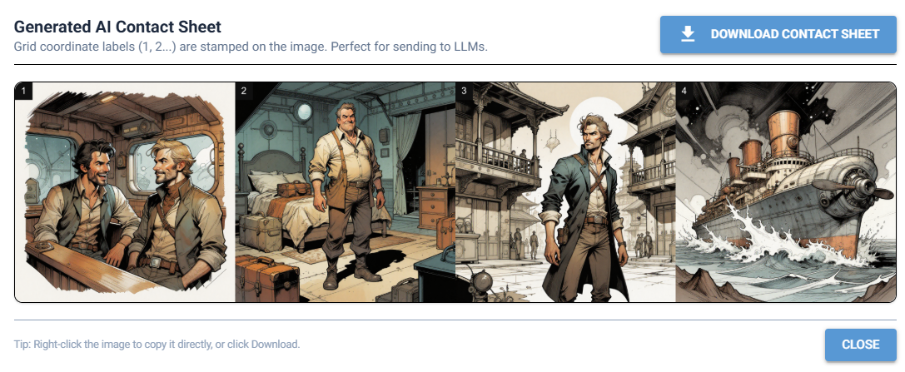
<br>

### 5. Image Preview Cards
Every generated playground image displays in an interactive card. Clicking an image expands a modal showing the scene prompt and target subtitle quote. A dedicated seed button allows you to regenerate that specific card with a new seed.

---

## Batch Image Generation

Once your style preset is calibrated and saved, you are ready to render the complete visual sequence for your project.

<br>
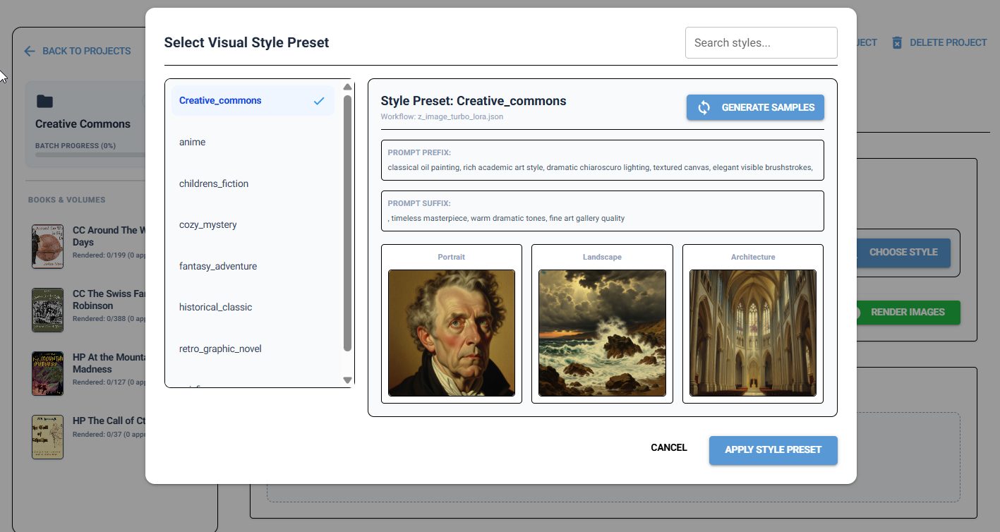
<br>

1. Return to the main project Dashboard.
2. Click **Choose Style** and select your saved preset.
3. Click **Render Images**.

<br>
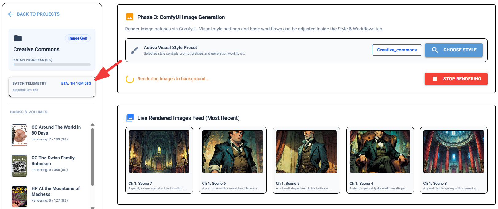
<br>

* **Dynamic Telemetry:** The sidebar displays real-time telemetry, calculating an Estimated Time Remaining (ETA) based on remaining scene count and your hardware's active rendering speed.
* **Live Feed:** The dashboard displays a live feed of the most recently completed images as they are output from ComfyUI.

---

## Proofreading, Approvals, and Selective Regeneration

ABI-Pipeline operates with a human-in-the-loop review process. You can approve or edit scenes during live generation, or complete your review once the batch finishes.

### The Workspace Grid
Clicking any book in the sidebar opens its dedicated illustration workspace. This page displays a grid of all scenes, visual prompts, and completed images.

* **Interactive Preview:** Clicking any image card launches the detailed approval viewer.

<br>
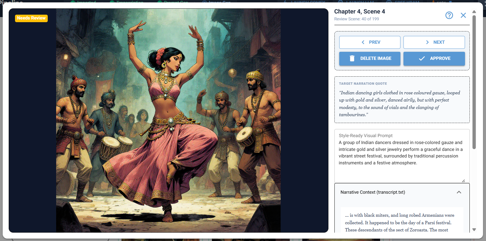
<br>

* **Keyboard Shortcuts:** For high-speed proofreading, use your keyboard:
  * Press `A` to approve the image and advance to the next scene.
  * Press `D` to delete the image if it does not match the scene context.
  * Press `F` or `S` to navigate manually between cards.
* **Live Prompt Edits:** If an image fails due to a poorly structured visual prompt, you can edit the text directly in this modal. The edited prompt is saved when you click delete, ensuring the next rendering attempt uses the updated instructions.

### Selective Regeneration
If you have deleted low-quality images or modified scene prompts, you do not need to rerender the entire book. 

<br>
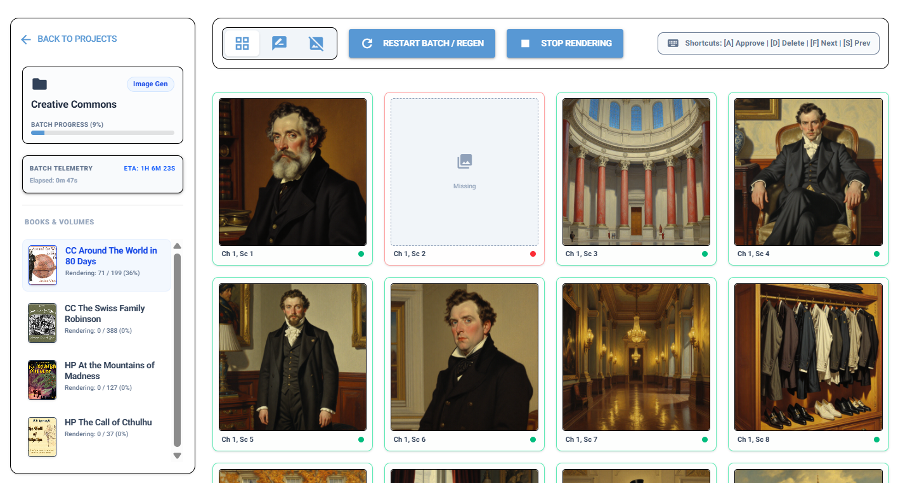
<br>

Clicking the **Restart Batch / Regen** button tells the pipeline to:
1. Finish rendering the current active queue item.
2. Restart the pipeline from the beginning of the volume.
3. Scan your local files, skipping all existing images.
4. Selectively regenerate only the missing images.

---

## Packaging Assets (The OIS Packager)

Once your book illustrations are rendered and approved, you can package them into unified archives. The pipeline includes a native packaging tool that complies with the [Open Illuminations Standard (OIS)](https://github.com/neshani/open-illuminations-standard). 

This step compiles your sequential images, baked metadata, and timing alignments into optimized `.zip` packages that are instantly recognized by the *Audiobooks Illuminated* players.

### Step 1: Global Pack Configuration

The **Direct OIS Packager Studio** tab provides global configurations to apply across all volumes in your active project.

<br>
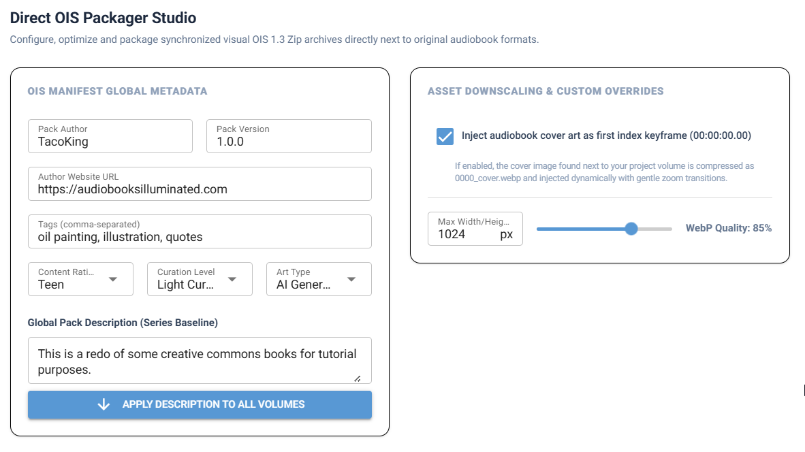
<br>

#### Global Metadata & Compression Settings
* **Global Metadata:** Define the default publisher/author name, website URL, search tags, content rating, and curation flags.
* **Asset Downscaling & WebP Conversion:** To prevent excessively large output files, the packager can automatically resize images and compress them into the WebP format. Use the sliders to define the maximum width/height resolution (e.g., `1024px`) and the target WebP Quality percentage (e.g., `85%`).

#### Timing Maps & Cover Art Injection
During the transcription and alignment phases, the pipeline estimates where each quote occurs in the audio file and writes these values to the local `prompts.csv` database. 

Because these timestamps correspond to actual narration, the first scene's quote rarely lands exactly at `00:00:00`. To prevent a blank screen during early-chapter silence or intro sequences, the **Inject audiobook cover art as first index keyframe** option is enabled by default. This compresses the local audiobook cover as `0000_cover.webp` and anchors it dynamically at `00:00:00.00` with smooth zoom transitions until the first narrative scene is reached.

### Step 2: Pre-Flight Integrity Check

Before packaging begins, the studio runs a validation check on all project volumes in the **Project Volumes Telemetry** panel.

<br>
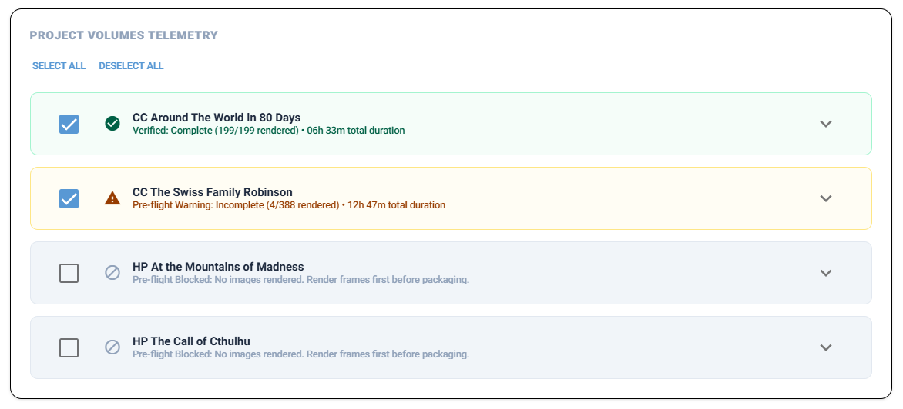
<br>

The pre-flight interface indicates the status of each book:
* **Verified (Green):** The book is complete and has all scenes successfully rendered.
* **Warning (Yellow):** The book is missing scene renders (e.g., only 4 of 388 frames rendered). It is still packageable, but the final package will be incomplete.
* **Blocked (Grey):** No images have been rendered for this volume. Packaging is blocked, and the volume is unselectable until frames are generated.

### Step 3: Volume Customization & Experience Variants

Expanding any verified book panel opens specific metadata configurations and viewing experience toggles.

<br>
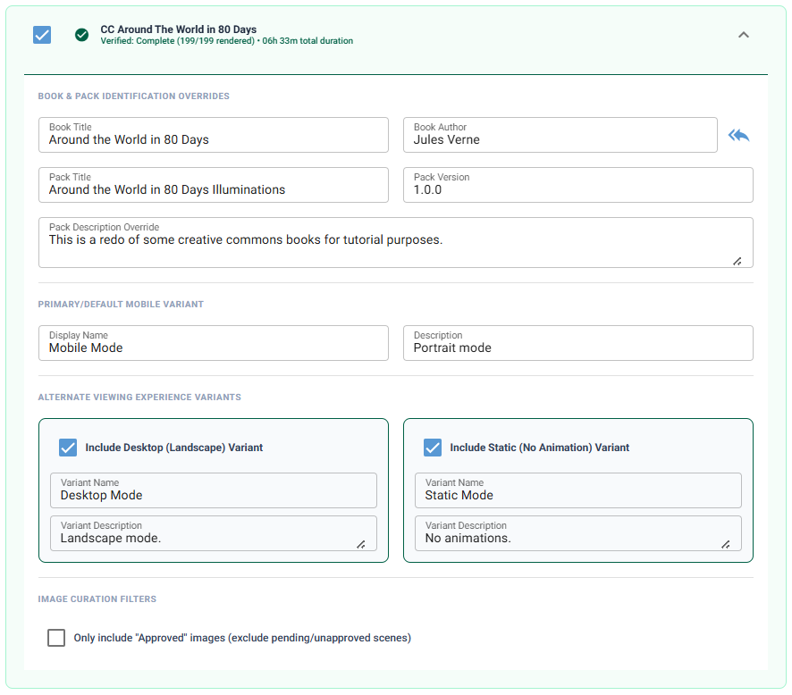
<br>

* **Metadata Overrides:** Customize individual book titles, authors, and version tags.
* **Bulk Property Application:** If the importer incorrectly parsed metadata fields during setup, click the **Apply** (back-arrow) icon next to the Author field to copy that value across all selected volumes in the batch.
* **Alternative Experience Variants:** Define which target viewing ratios to compile.
  * **Include Desktop (Landscape) Variant:** Packages landscape versions of your renders.
  * **Include Static (No Animation) Variant:** Packages flat images for players with animations disabled.

### Step 4: Compiling and Outputting

Once your metadata, compression thresholds, and variants are configured, verify the selected volumes and run the packaging compiler.

<br>
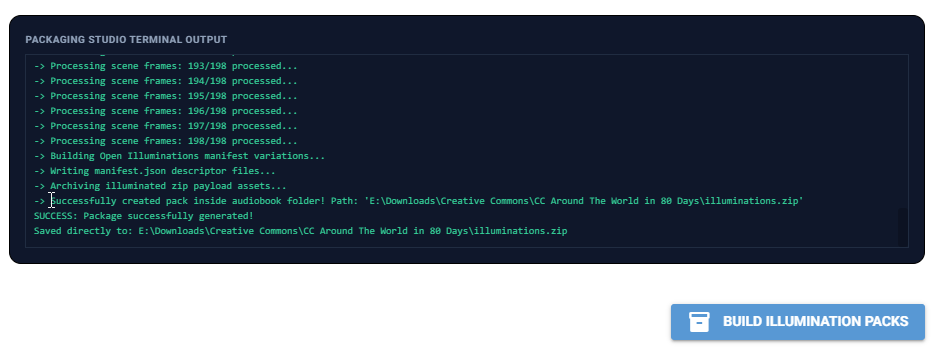
<br>

1. Click the **Build Illumination Packs** button.
2. The compilation progress is printed in real-time in the terminal output panel, displaying folder exports, manifest creation, and zip archiving progress.
3. Once completed, the final `illuminations.zip` archive is saved directly inside each respective audiobook’s folder.

---

## Playing Your Illuminated Audiobooks

If you use the official desktop player, the application automatically detects, unpacks, and matches the illustrations when you open the audiobook.

<br>
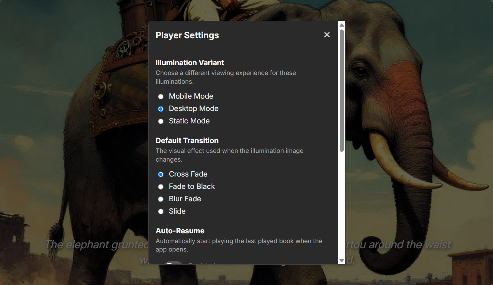
<br>

### Setup Tips
* Keep the compiled `illuminations.zip` file in the same directory as your source audiobook file.
* Once the player loads, open **Player Settings** and switch your **Illumination Variant** to **Desktop Mode** (or your target mobile portrait ratio) to ensure correct image framing, scaling, and transition animations.
